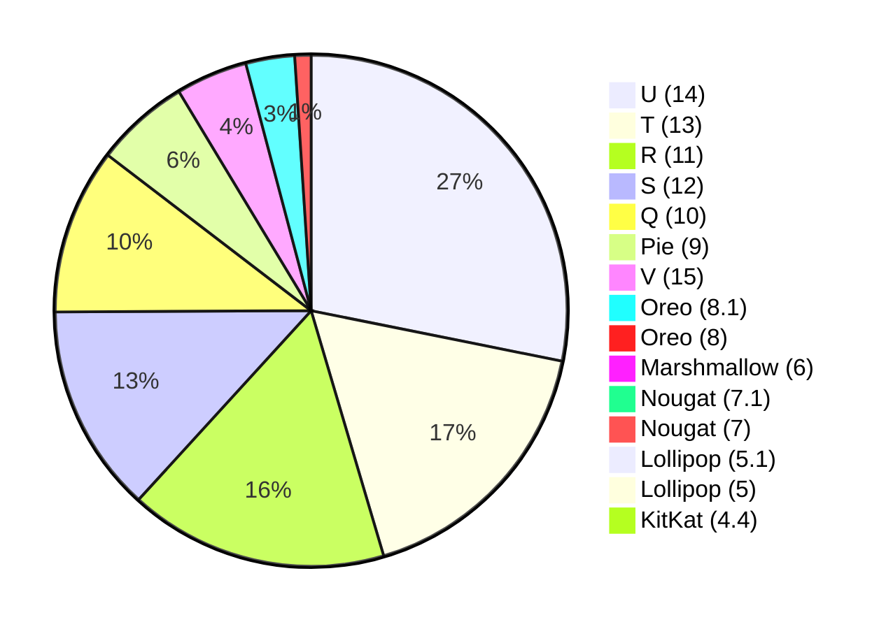

# Android Version Distribution 

| Name | Version | API |  % |
|------|--------:|----:|---:|
| [V](#api-35) | 15 | 35 | 4.4% |
| [U](#api-34) | 14 | 34 | 27.4% |
| [T](#api-33) | 13 | 33 | 16.8% |
| [S](#api-31) | 12 | 31 | 12.8% |
| [R](#api-30) | 11 | 30 | 15.9% |
| [Q](#api-29) | 10 | 29 | 10.2% |
| [Pie](#api-28) | 9 | 28 | 5.8% |
| [Oreo](#api-27) | 8.1 | 27 | 3% |
| [Oreo](#api-26) | 8 | 26 | 1% |
| [Nougat](#api-25) | 7.1 | 25 | 0.6% |
| [Nougat](#api-24) | 7 | 24 | 0.6% |
| [Marshmallow](#api-23) | 6 | 23 | 0.7% |
| [Lollipop](#api-22) | 5.1 | 22 | 0.5% |
| [Lollipop](#api-21) | 5 | 21 | 0.1% |
| [KitKat](#api-19) | 4.4 | 19 | 0.1% |

---

---

##### [V](https://developer.android.com/about/versions/15)

###### Camera and media

> Low Light Boost In-app Camera Controls HDR headroom control Loudness control Virtual MIDI 2.0 Devices More efficient AV1 software decoding

###### Connectivity

> Satellite support Smoother NFC experiences Wallet role

###### Developer productivity and tools

> OpenJDK 17 updates PDF improvements Automatic language switching refinements Improved OpenType Variable Font API Granular line break controls App archiving

###### Graphics

> Modernizing Android's GPU access Improvements for Canvas

###### Large screens and form factors

> Improved large screen multitasking Cover screen support

###### Performance and battery

> ApplicationStartInfo API Detailed app size information App-managed profiling SQLite database improvements Android Dynamic Performance Framework updates

###### Privacy

> Screen recording detection Expanded IntentFilter capabilities Private space Query most-recent user selection for Selected Photos Access Privacy Sandbox on Android Health Connect Partial screen sharing

###### Security

> Integrate Credential Manager with autofill Integrate single tap sign-up and sign-in with biometric prompts Key management for end-to-end encryption Permission checks on content URIs

###### User experience and system UI

> Richer widget previews with Generated Previews API Picture-in-picture improvements Improved Do Not Disturb rules Set VibrationEffect for notification channels Media projection status bar chip and auto stop

> [!NOTE]  
> Last updated: April 1, 2025

##### [U](https://developer.android.com/about/versions/14)

###### New features

> Ultra HDR for images Zoom, Focus, Postview, and more in camera extensions Lossless USB audio Health Connect Add custom actions Custom meshes with vertex and fragment shaders

###### Behavior changes

> Foreground service types are required Enforcement of BLUETOOTH_CONNECT permission JobScheduler reinforces callback and network behavior Apps can kill only their own background processes Schedule exact alarms are denied by default Data safety information is more visible Minimum installable target API level

###### Security and privacy

> Credential Manager Improvements for app stores Detect when users take device screenshots Secure full-screen Intent notifications Restrictions to implicit and pending intents Safer dynamic code loading restrictions on starting activities from the background User consent required for each MediaProjection

> [!NOTE]  
> Last updated: April 1, 2025

##### [T](https://developer.android.com/about/versions/13)

###### New features

> Tablet and large screen support Programmable shaders Color vector fonts Predictive back gesture Bluetooth LE Audio Splash screen efficiency improvements ART optimizations

###### Behavior changes

> OpenJDK 11 updates Battery Resource Utilization Media controls derived from PlaybackState Permission required for advertising ID Updated non-SDK restrictions

###### Security and privacy

> Safer exporting of context-registered receivers Enhanced photo picker privacy New runtime permission for nearby Wi-Fi devices Exact alarms permission Developer downgradable permissions APK Signature Scheme v3.1 Better error reporting in Keystore and KeyMint

> [!NOTE]  
> Last updated: April 1, 2025

##### [S](https://developer.android.com/about/versions/12)

###### New features

> Material You Redesigned widgets  Game Mode Rich content insertion AppSearch API Compatible media transcoding Improved notifications

###### Behavior changes

> Performance Classes Stretch overscroll App splash screens Restricted App Standby Bucket Improved refresh rate switching Passpoint updates

###### Security and privacy

> App hibernation Nearby device permissions Approximate location Bluetooth permissions Permission group lookup Clipboard access notifications Permission package visibility

###### Large screen support (12L)

> System UI optimizations App taskbar Drag and drop an app into split-screen mode fast app-switching Visual and stability improvements to compatibility mode Activity embedding with Jetpack WindowManager

> [!NOTE]  
> Last updated: April 1, 2025

##### [R](https://developer.android.com/about/versions/11)

###### New features

> Chat Bubbles Conversation improvements Wireless debugging Neural Networks API 1.3 Frame rate API

###### Behavior changes

> Exposure Notifications Conscrypt SSL engine by default Non-SDK interface restrictions URI access permissions requirements

###### Security and privacy

> Scoped storage enforcement One-time permissions Permissions auto-reset Background location access Package visibility Foreground services Secure sharing of large datasets

> [!NOTE]  
> Last updated: April 1, 2025

##### [Q](https://developer.android.com/about/versions/10)

###### System

> Foldables support 5G support Gesture navigation ART optimizations Neural Networks API 1.2 Thermal API

###### User Interface

> Smart Reply in notifications Dark theme Settings panels Sharing shortcuts

###### Camera and media

> Dynamic depth for photos Audio playback capture New codecs Native MIDI API Vulkan everywhere Directional microphones

###### Security and privacy

> New location permissions Storage encryption TLS 1.3 by default Platform hardening Improved biometrics

> [!NOTE]  
> Last updated: April 1, 2025

##### [Pie](https://developer.android.com/about/versions/pie/android-9.0)

###### System

> Indoor positioning with Wi-Fi RTT Multi-camera support Display cutout support

###### User Interface

> Improved notifications Improved text support ImageDecoder and new animation classes

###### Media

> HDR VP9 video HEIF image compression Improved media APIs

###### Security and privacy

> Android Protected Confirmation Biometric authentication dialogs Hardware security module Secure key import Client-side encryption backups

###### Accessibility

> Navigation semantics Convenience actions Magnifier

> [!NOTE]  
> Last updated: April 1, 2025

##### [Oreo](https://developer.android.com/about/versions/oreo/android-8.1)

###### System

> Android Go Neural Networks API Programmatic Safe Browsing actions Shared memory API

###### User Interface

> Improved Notifications EditText update WallpaperColors API

###### Media

> Video thumbnail extractor

###### Security & Privacy

> Fingerprint updates Cryptography updates

> [!NOTE]  
> Last updated: April 1, 2025

##### [Oreo](https://developer.android.com/about/versions/oreo/android-8.0)

###### System

> Custom data store JobScheduler improvements Cached data

###### User Interface

> Picture-in-Picture mode Improved Notifications Autofill framework Downloadable fonts Multi-display support Adaptive icons

###### Media

> VolumeShaper Audio focus enhancements Media metrics MediaPlayer and MediaRecorder improvements Improved media file access

###### Wireless & Connectivity

> Wi-Fi Aware Bluetooth updates Companion device pairing

###### Security & Privacy

> New permissions New account access and discovery APIs

###### Runtime & Tools

> Platform optimizations Updated Java language support Updated ICU4J Android Framework APIs

> [!NOTE]  
> Last updated: April 1, 2025

##### [Nougat](https://developer.android.com/about/versions/nougat/android-7.1.html)

###### System

> Enhanced Live Wallpaper Metadata Storage Manager Intent Demo User Hint

###### VR

> Improved VR Thread Scheduling

###### User Interface

> App Shortcuts Round Icon Resources

###### User Input

> Image Keyboard Support New Professional Emoji

###### Wireless & Connectivity

> APIs for Carriers and Calling Apps

###### Wear

> New Screen Densities for Wear Devices

> [!NOTE]  
> Last updated: April 1, 2025

##### [Nougat](https://developer.android.com/about/versions/nougat/android-7.0.html)

###### User Interface

> Multi-window Support Notifications Quick Settings Tile API Custom Pointer API

###### Performance

> Profile-guided JIT/AOT Compilation Quick Path to App Install Sustained Performance API Frame Metrics API

###### Battery Life

> Doze on the Go Project Svelte: Background Optimizations SurfaceView

###### Wireless & Connectivity

> Data Saver Number Blocking Call Screening

###### Graphics

> Vulkan API

###### System

> Direct Boot Multi-locale Support, More Languages ICU4J APIs in Android APK Signature Scheme v2 Scoped Directory Access Keyboard Shortcuts Helper Virtual Files

###### Android for Work

> Work profile security challenge Turn off work Always on VPN Customized provisioning

###### Accessiblity

> Vision Settings on the Welcome screen

###### Security

> Key Attestation Network Security Config Default Trusted Certificate Authority

###### VR

> Platform support and optimizations for VR Mode

###### Printing Framework

> Print service enhancements

> [!NOTE]  
> Last updated: April 1, 2025

##### [Marshmallow](https://developer.android.com/about/versions/marshmallow/android-6.0.html)

###### Security

> Fingerprint Authentication Confirm Credential

###### System

> App Linking Adoptable Storage Devices

###### Multimedia

> 4K Display Mode Support for MIDI Create digital audio capture and playback objects APIs to associate audio and input devices List of all audio devices Updated video processing APIs Flashlight API Reprocessing Camera2 API Updated ImageWriter objects and Image Reader class

###### User Input

> Voice Interactions Assist API Bluetooth Stylus Support

###### User Interface

> Themeable ColorStateLists

###### Wireless & Connectivity

> Hotspot 2.0 Improved Bluetooth Low Energy Scanning

###### Android for Work

> Controls for Corporate-Owned, Single-Use devices Silent install and uninstall of apps by Device Owner Silent enterprise certificate access Auto-acceptance of system updates Delegated certificate installation Data usage tracking Runtime permission management Work status notification

> [!NOTE]  
> Last updated: April 1, 2025

##### [Lollipop](https://developer.android.com/about/versions/android-5.1.html)

###### Wireless & Connectivity

> Multiple SIM Card Support Carrier Provisioning

###### API Change

> Deprecated HTTP Classes

> [!NOTE]  
> Last updated: April 1, 2025

##### [Lollipop](https://developer.android.com/about/versions/android-5.0.html)

###### User Interface

> Material design support Concurrent documents and activities in the recents screen WebView updates Screen capturing and sharing

###### Notifications

> Lock screen notifications Notifications metadata

###### Graphics

> Support for OpenGL ES 3.1 Android Extension Pack

###### Media

> Camera API for advanced camera capabilities Audio playback Media playback control Media browsing

###### Storage

> Directory selection

###### Wireless & Connectivity

> Multiple network connections Bluetooth Low Energy NFC enhancements

###### Battery - Project Volta

> Scheduling jobs Developer tools for battery usage

###### Android in the Workplace and in Education

> Managed provisioning Device owner Screen pinning

###### Printing Framework

> Render PDF as bitmap

###### System

> App usage statistics

###### Testing & Accessibility

> Testing and accessibility improvements

###### IME

> Easier switching between input languages

###### Manifest Declarations

> Declarable required features User permissions

> [!NOTE]  
> Last updated: April 1, 2025

##### [KitKat](https://developer.android.com/about/versions/android-4.4.html)

###### Printing Framework

> Print generic content Print images OEM print services

###### SMS Provider

> Read and write SMS and MMS messages Select default SMS app

###### Wireless and Connectivity

> Host NFC card emulation NFC reader mode Infrared support

###### Multimedia

> Adaptive video playback On-demand audio timestamps Surface image reader Peak and RMS audio measurements Loudness enhancer Remote controllers Closed captions

###### Animation and Graphics

> Scenes and transitions Animator pausing Reusable bitmaps

###### User Content

> Storage access framework External storage access Sync adapters

###### User Input

> New sensor types, including step detector Batched sensor events Controller identities

###### User Interface

> Immersive full-screen mode Translucent system bars Enhanced notification listener Live regions for accessibility

> [!NOTE]  
> Last updated: April 1, 2025

